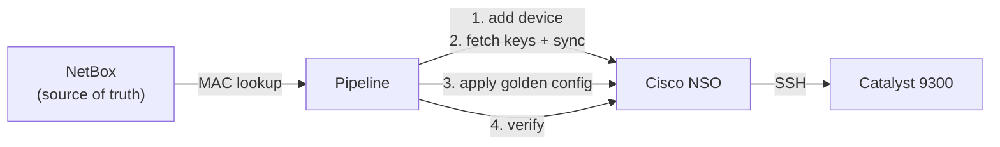

# IPV6 ZTP NSO Demo

A small demo of the **onboarding + provisioning core** from an IPv6
zero-touch provisioning (ZTP) reference design using Cisco NSO and NetBox

> "IPv6 Zero-Touch Provisioning with Cisco NSO and NetBox"

## The idea

Plug a Catalyst 9300 into the network, and let it configure itself:

1. NetBox is the source of truth (which MAC gets which IPv6, model, target hostname)
2. KEA DHCPv6 hands out the reserved address plus a bootfile URL (Option 59)
3. The switch runs a small Day-0 script to enable SSH so NSO can reach it
4. A pipeline onboards the device into NSO and pushes a golden config
5. Robot Framework verifies the result

This demo focuses on steps 4 and 5, the part most people want to reuse



## What is in here

| File | What it shows |
|------|---------------|
| `data/example_netbox_device.json` | The device data shape the scripts expect from NetBox |
| `scripts/netbox.py` | Look up a device by MAC (returns the example data offline) |
| `scripts/onboard_example.py` | Add device to NSO, fetch host keys, sync-from (RESTCONF) |
| `scripts/provision_example.py` | Apply a golden-config service package by model (RESTCONF) |
| `.gitlab-ci.example.yml` | The pipeline stages that tie it together |
| `test/config_tests.robot` | One example post-provision check |

## Prerequisites

- A reachable Cisco NSO instance with a NED for your device and a service package
- NetBox as your source of truth
- KEA DHCPv6 for the Day-0 address + bootfile (not included here; see the article)
- A Catalyst 9300 on IOS XE Fuji 16.9.1 or later (DHCPv6-based ZTP is supported from
  that release onward)
- Python 3.9+ and `requests`

## Configure

Copy the example config and fill in your own values:

```bash
cp config.example.env config.env
# edit config.env: NSO host, user, pass
```
